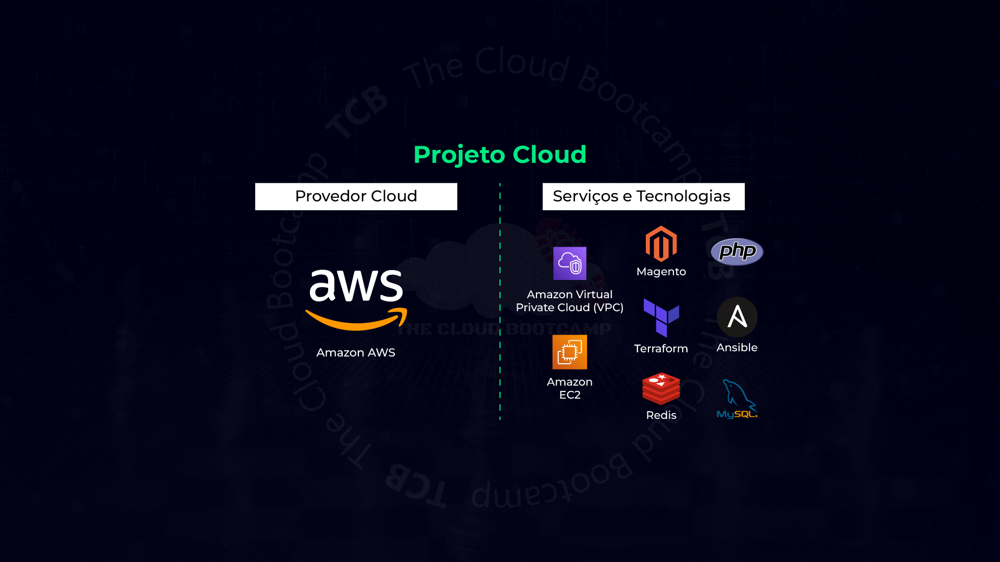
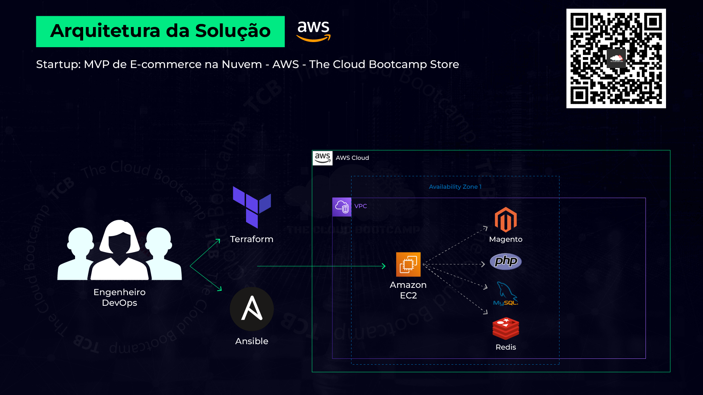
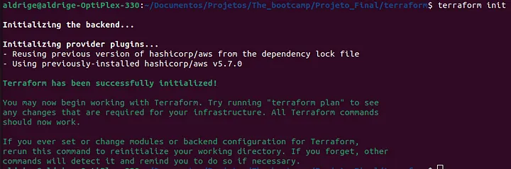
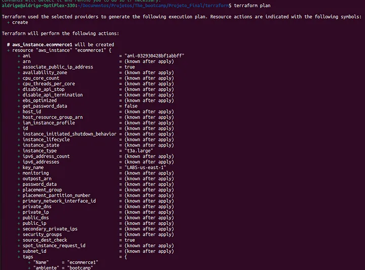
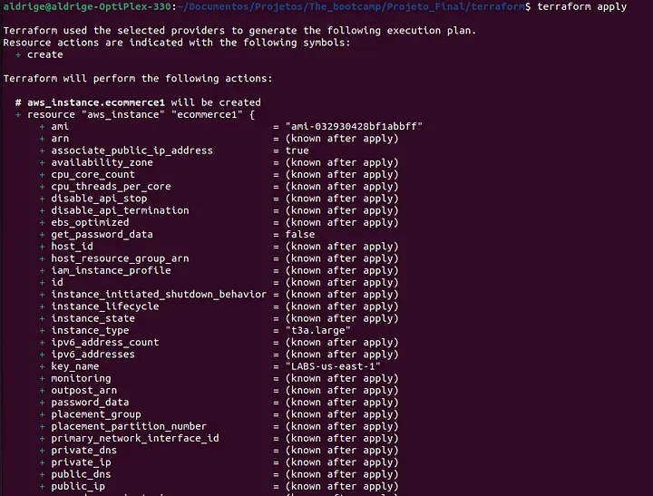
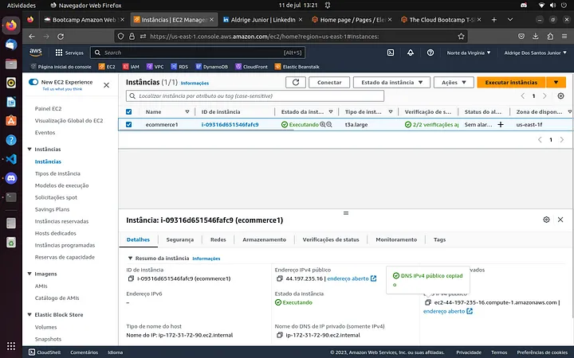
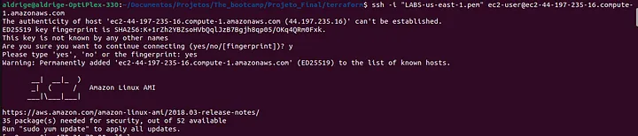
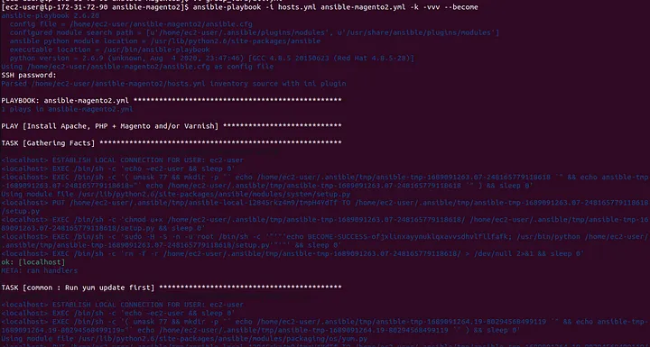
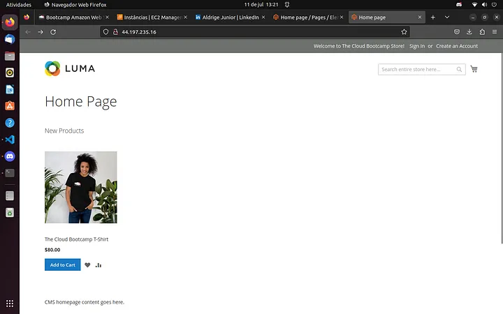
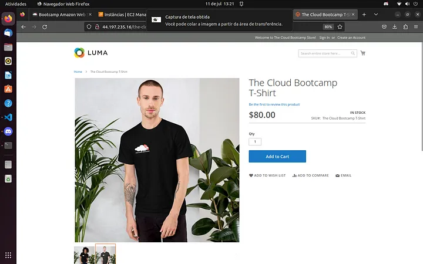

  <h1 align="center">Implementação de um Sistema de E-Commerce na AWS de forma automatizada usando Terraform e Ansible</h1>

## Descrição do projeto:
NEm mais um projeto baseado em um cenário do mundo real, atuei como Engenheiro Cloud utilizando DevOps, onde criei e implementei um MVP (Mínimo Produto Viável) de e-Commerce na AWS em menos de 2 horas e de forma automatizada, usando Terraform e Ansible (Infraestrutura como Código — IaC).

Fiz o provisionamento da infraestrutura de forma automatizada utilizando Terraform e também utilizei o Ansible para automatizar o processo de gerenciamento de configurações, instalação de softwares e gerenciamento de pacotes da instância EC2. Utilizei também o Magento, PHP, MySQL e o Redis para completar esse projeto.

Parte 1 : E-commerce MVP deployment

- Executando o Terraform

    
terraform init

    
    
terraform plan

    
    
terraform apply

    

ls | novo arquivo foi criado: ‘terraform.tfstate’

Instancia EC2 rodando:

Parte 2: Instalando Ansible na EC2

- Conectando na instância EC2 :

    
ssh -i sshkey1.pem ec2-user@ec2-public-ip

- Instalando Ansible na EC2

sudo yum-config-manager — enable epel
sudo yum install ansible -y

- Download do playbook para execução do Ansible

• wget https://tcb-bootcamps.s3.amazonaws.com/bootcamp-aws/pt/module7/projeto-final-ansible-magento2.zip
• unzip projeto-final-ansible-magento2.zip

- Editar os parametros

• cd ansible-magento2
• vi group_vars/all.yml

* magento_domain: ec2-public-ip
* server_hostname: ec2-public-ip
* repo_api_key: b2041f02509330fbbb96312b29995cb6 (insira sua chave publica)
* repo_secret_key: 7be7c69e79bd798a2a8a6b00983a5b72 (insira sua chave privada)

• Save the file (“Esc” | “:x”)

- Executando Ansible para fazer o deploy das ferramentas do e-commerce

    ansible-playbook -i hosts.yml ansible-magento2.yml -k -vvv — become

- Testando E-commerce Website:

• Copie e Cole o IP Público da EC2 em um navegador

- Configurando o e-commerce:

• http://<EC2_PUBLIC_IP>/securelocation

User: Admin
Password: Strong123Password#

- Download dos arquivos (imagens) do e-commerce

• https://tcb-bootcamps.s3.amazonaws.com/bootcamp-aws/pt/module7/final-project-images.zip

— Content > Configuration > Default Store View > Edit
— — ‘HTML Head’ | Default page title: The Cloud Bootcamp Store
— — ‘Header’ > Logo image: The Cloud Bootcamp logo from images
— — ‘Header’ > Welcome text: Welcome to The Cloud Bootcamp Store!
— — Save Configuration!

• Se for requisitado “Refresh no Cache”, siga esses passos:

— — Cache Refresh (Flush it) | Please go to ‘Cache Management’ and refresh cache types.

Configuration Status: INVALIDATED | Select it and Click on “Flush Mageno Cache’

• Caso contrário, siga os passos de customização do e-commerce!

— Catalog > Products > Add product > The Cloud Bootcamp T-Shirt
— — Price: 80
— — Quantity: 100
— — Images And Videos > Add images
— — Save

— Content > Pages > Home Pages > Select | Edit
— — Click Content > Erase content
— — Insert Widget > Widget type: Catalog New Products List > Insert Widget

- Validando as alterações realizadas:

Click em Admin | Customer View

Parabéns!!! E-commerce implementado com sucesso!!!

